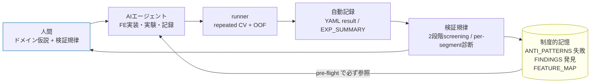

# ml-experiment-harness

> **人間がドメイン仮説を立て、AIエージェントが実装・実験・記録を担い、ハーネスが再現性と"制度的記憶"を保証する** ML 実験基盤。
> AI を「使う」のではなく、**人間の仮説を AI が正しく・再現可能に実装できる環境とガードレール**を設計したもの。

Kaggle 型コンペ (NFL Draft 予測, 200+ 実験) で実戦投入した基盤を、ドメイン非依存に汎用化したテンプレート。

> **クローンすれば 分類でも回帰でも使える。** タスク固有なのは「指標・CV・モデル」の3つだけで、
> YAML の `task:` で `classification` / `regression` を選ぶ (例: 回帰は天気予測=予報の代理)。
> `experiments-sample/` に**分類の動くサンプル**を同梱。利用者は `experiments/` を作って自分の問題を回す。

## 役割分担 (ここが核心)

| 主体 | 担当 | 例 |
|---|---|---|
| **人間** | **ドメイン仮説** + 抽象指示 + **検証規律** | 「この特徴は線形なら効くはず」「この改善は過学習では？」 |
| **AIエージェント** | 実装・実験・記録 | `@register_feature` で実装、YAML を書き、CV を回し、結果を記録 |
| **ハーネス** | 再現性 + 制度的記憶 | seed固定・リーク防止を構造で強制、失敗を蓄積し pre-flight で参照 |

AI は仮説を**発明しない**。人間が立てた仮説を AI が**速く・正確に・再現可能に実装して検証する**。

## クイックスタート (実際に動く)

```bash
pip install -r requirements.txt

# 分類サンプル (breast_cancer)
python -m src.runner --config experiments-sample/EXP000/configs/child-exp000_baseline.yaml
python -m src.runner --config experiments-sample/EXP000/configs/child-exp001_standardize.yaml

# 同じハーネスで回帰も: YAML の task を regression に、dataset を diabetes にするだけ
#   (config: { dataset: diabetes, task: regression, model: tree, features: [ratio] })

python -m src.runner --summary       # docs/EXP_SUMMARY.md を全YAMLから再生成
python -m src.runner --feature-map   # docs/FEATURE_MAP.md を taxonomy から再生成
pytest tests/ -q
```

## experiments-sample/ の構造 (EXP境界ルールを実演)

NFL ハーネスと同じ **EXP(大テーマ) → child-exp(個別実験)** の2層構造 (3桁)。
**何が同じ EXP の child で、何が新 EXP か**が分類の規律になっている:

| EXP | テーマ | 境界ルール | children |
|---|---|---|---|
| `EXP000` | FE探索 (tree) | **FE追加 = 同EXPのchild** | baseline / +standardize / +segment_te |
| `EXP001` | 線形モデル | **model変更 = 新EXP** | logreg baseline / +standardize |
| `EXP002` | アンサンブル | **ensemble = 新EXP** | tree(raw)+linear(std) rank平均 |

### このサンプルが示す実証 (taxonomy の検証)

`docs/EXP_SUMMARY.md` (自動生成) の Δ が、`src/feature_taxonomy.py` の分類を実データで裏付ける:

| 実験 | Δ vs parent | 読み取り |
|---|---|---|
| EXP000 tree + `standardize` | **+0.00000** | 木はスケール不変 → 標準化は効かない |
| EXP001 linear + `standardize` | **+0.00263** | 線形には標準化が効く |
| EXP002 ensemble | +0.00221 | 木(raw)+線形(std) の混合で単体超え |

→ **同じ `standardize` が木で無効・線形で有効**。これは taxonomy の `models`/`scale` 軸が表す通り。
特徴量を族×モデルで分類しておく価値が、ここに出る。

## アーキテクチャ — 制度的記憶を持つ実験ループ



肝は **MEM→エージェント の戻り矢印 (pre-flight)**。新実験の前に過去の失敗と族レベルの機序を必ず読むので
**同じ種類の失敗を繰り返さない**。これが「AI が暴走せず正しく動く環境」の正体。

## コンポーネント

| ファイル | 役割 |
|---|---|
| `src/feature_registry.py` | `@register_feature` — YAML から名前で特徴量を呼ぶ |
| `src/features.py` | 汎用の例示特徴量 (各 kind を代表) |
| `src/feature_taxonomy.py` | **機械可読 SSOT**: 特徴量を kind/models/scale/leak で分類 |
| `src/feature_map.py` | taxonomy → `docs/FEATURE_MAP.md` を自動生成 |
| `src/tasks.py` | **分類/回帰の両 Task を定義**。YAML の `task:` で選ぶ seam |
| `src/data.py` | サンプルデータ (breast_cancer/diabetes)。実運用はここを差し替え |
| `src/diagnostics.py` | repeated CV + per-segment 汎化診断 |
| `src/runner.py` | YAML→構築→CV→自動記録→集約 の心臓。CLI |
| `docs/ANTI_PATTERNS.md` | 制度的記憶: **失敗**＋理由 (Claude が追記(自動生成でない)、pre-flight で参照) |
| `docs/FINDINGS.md` | 制度的記憶: **効いた施策＋確認された新事実** (Claude が追記(自動生成でない)、ANTI_PATTERNS の正の対) |
| `docs/EXP_SUMMARY.md` / `docs/FEATURE_MAP.md` | 自動生成 (手動編集禁止) |
| `.claude/skills/feature-experiment/` | 実験プロトコルを完遂する skill (pre-flight→実装→実行→記録→再評価) |
| `.claude/agents/` | 助言専任エージェントチーム雛形 (ml-methodology-expert + domain-expert) |

## 設計原則 (なぜ"AIが正しく動く"のか)

1. **Single Source of Truth**: 分類・構成はコードの1箇所。派生は自動生成。
2. **ドリフト防止**: 派生は常に再生成 + テストで stale 検出 (手動同期ゼロ)。
3. **リーク防止の制度化**: CV fold = TE fold を runner が強制 (エージェントが間違えても構造で守る)。
4. **制度的記憶 + 再評価**: 失敗 (ANTI_PATTERNS) と発見 (FINDINGS) を蓄積し pre-flight で必ず読む。
   さらに**新事実が片方に入ると反対側の過去判定を再評価する** (トリガ照合) → 同じミスをせず、過去の失敗も知識更新で蘇らせる。

## 自分の問題で使う

1. `src/data.py` の `load_dataset` を自分のデータ読込に差し替える (規約: features + `segment` + `y`)。
2. `experiments/EXP000/configs/child-exp000_baseline.yaml` を作り、`task:` を選ぶ
   (分類=`classification` / 回帰=`regression`、時系列予報なら `tasks.py` の CV を `TimeSeriesSplit` に)。
3. 必要な特徴量を `src/features.py` に `@register_feature` で足し、`feature_taxonomy.py` に分類を追加 (テストが強制)。
4. `python -m src.runner --config ...` → 自動で記録・集約・マップ更新。

ループ本体 (registry / 記録 / 制度的記憶 / 診断) は**タスクが変わっても一切変えない**。

---

*出自: NFL Draft 予測コンペの実験基盤を汎用化。本リポジトリは構造を示すモックで、
具体の実戦実績・war story は元コンペ repo 側にある。*
