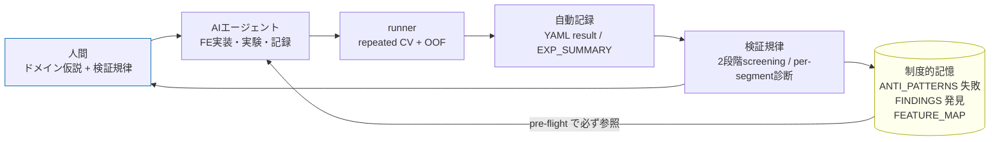

# ml-experiment-harness

> **人間がドメイン仮説を立て、AIエージェントが実装・実験・記録を担い、ハーネスが再現性と"制度的記憶"を保証する** ML 実験基盤。
> AI を「使う」のではなく、**人間の仮説を AI が正しく・再現可能に実装できる環境とガードレール**を設計したもの。

Kaggle 型コンペ (NFL Draft 予測, 200+ 実験) で実戦投入した基盤を、ドメイン非依存に汎用化したテンプレート。

> **クローンすれば 分類でも回帰でも使える。** タスク固有なのは「指標・CV・モデル」の3つだけで、
> YAML の `task:` で `classification` / `regression` を選ぶ (例: 回帰は天気予測=予報の代理)。
> `experiments-sample/` に**分類の動くサンプル**を同梱。利用者は `experiments/` を作って自分の問題を回す。

## 役割分担 (ここが核心)

| 主体 | 担当 | 例 |
|---|---|---|
| **人間** | **ドメイン仮説** + 抽象指示 + **検証規律** | 「この特徴は線形なら効くはず」「この改善は過学習では？」 |
| **AIエージェント** | 実装・実験・記録 | `@register_feature` で実装、YAML を書き、CV を回し、結果を記録 |
| **ハーネス** | 再現性 + 制度的記憶 | seed固定・リーク防止を構造で強制、失敗を蓄積し pre-flight で参照 |

AI は仮説を**発明しない**。人間が立てた仮説を AI が**速く・正確に・再現可能に実装して検証する**。

## クイックスタート (実際に動く)

```bash
pip install -r requirements.txt

# 分類サンプル (breast_cancer)
python -m src.runner --config experiments-sample/EXP000/configs/child-exp000_baseline.yaml
python -m src.runner --config experiments-sample/EXP000/configs/child-exp001_standardize.yaml

# 同じハーネスで回帰も: YAML の task を regression に、dataset を diabetes にするだけ
#   (config: { dataset: diabetes, task: regression, model: tree, features: [ratio] })

python -m src.runner --summary       # docs/EXP_SUMMARY.md を全YAMLから再生成
python -m src.runner --feature-map   # docs/FEATURE_MAP.md を taxonomy から再生成
pytest tests/ -q
```

## experiments-sample/ の構造 (EXP境界ルールを実演)

NFL ハーネスと同じ **EXP(大テーマ) → child-exp(個別実験)** の2層構造 (3桁)。
**何が同じ EXP の child で、何が新 EXP か**が分類の規律になっている:

| EXP | テーマ | 境界ルール | children |
|---|---|---|---|
| `EXP000` | FE探索 (tree) | **FE追加 = 同EXPのchild** | baseline / +standardize / +segment_te |
| `EXP001` | 線形モデル | **model変更 = 新EXP** | logreg baseline / +standardize |
| `EXP002` | アンサンブル | **ensemble = 新EXP** | tree(raw)+linear(std) rank平均 |

### このサンプルが示す実証 (taxonomy の検証)

`docs/EXP_SUMMARY.md` (自動生成) の Δ が、`src/feature_taxonomy.py` の分類を実データで裏付ける:

| 実験 | Δ vs parent | 読み取り |
|---|---|---|
| EXP000 tree + `standardize` | **+0.00000** | 木はスケール不変 → 標準化は効かない |
| EXP001 linear + `standardize` | **+0.00263** | 線形には標準化が効く |
| EXP002 ensemble | +0.00221 | 木(raw)+線形(std) の混合で単体超え |

→ **同じ `standardize` が木で無効・線形で有効**。これは taxonomy の `models`/`scale` 軸が表す通り。
特徴量を族×モデルで分類しておく価値が、ここに出る。

## 実験の再利用 (op registry + OOF キャッシュ)

派生実験のたびに script をコピペするのは非効率。そこで:

1. **全実験は OOF を自動キャッシュ** (`experiments*/<EXP>/outputs/<child>_oof.npy`)。
2. **手法は登録 op** (`@register_op`, `src/ops.py`) として1回だけ書く (rank_blend / weight_search …)。
3. **派生実験は小さな YAML**: `method:` で op を、`inputs:` で親実験の OOF を参照するだけ。

```yaml
# experiments-sample/EXP003/configs/child-exp000_blend_tree_linear.yaml
config:
  method: rank_blend                                  # ← 登録 op
  inputs: [EXP000/child-exp000_baseline,              # ← 親の OOF を再利用
           EXP001/child-exp000_logreg_baseline]
```

→ blend に変えたい/重み探索したい時は **`method:` を差し替えるだけ**。再学習なし・自動記録:

| 派生実験 | method | AUC | 親比 |
|---|---|---|---|
| EXP000 baseline (tree) | — | 0.9912 | — |
| EXP001 baseline (linear) | — | 0.9901 | — |
| EXP003 blend | `rank_blend` | **0.99415** | +0.0030 |
| EXP003 wsearch | `weight_search` | **0.99436** | +0.0032 |

**手法 = 再利用可能な op / 実験 = YAML / 親の成果物 = OOF キャッシュ参照**。
script に閉じ込めないので、同じ/派生実験が YAML 差し替えだけで回る。

> YAML の読み方（特徴量も op も全手法が記録される点）は **[docs/YAML_GUIDE.md](docs/YAML_GUIDE.md)** 参照。

## アーキテクチャ — 制度的記憶を持つ実験ループ



肝は **MEM→エージェント の戻り矢印 (pre-flight)**。新実験の前に過去の失敗と族レベルの機序を必ず読むので
**同じ種類の失敗を繰り返さない**。これが「AI が暴走せず正しく動く環境」の正体。

## リポジトリ構成 (解説付きツリー)

```
ml-experiment-harness/
├── README.md                      # これ
├── requirements.txt               # numpy / pandas / scikit-learn / pyyaml / pytest
│
├── src/                           # ── ハーネス本体 ──
│   ├── config.py                  # SEED / N_FOLDS / STAGE1・STAGE2_SEEDS (規律の定数)
│   ├── data.py                    # サンプルデータ読込。★実運用はここを自分のデータに差し替え
│   ├── tasks.py                   # ★唯一のタスク固有部分: classification/regression の指標・CV・モデル
│   ├── feature_registry.py        # @register_feature — YAML から名前で特徴量を呼ぶ
│   ├── features.py                # 例示特徴量 (各 kind を代表)
│   ├── feature_taxonomy.py        # ★機械可読SSOT: 特徴量を kind/models/scale/leak で分類
│   ├── feature_map.py             # taxonomy → docs/FEATURE_MAP.md を生成
│   ├── op_registry.py             # ★@register_op — YAML の method: で「手法」を呼ぶ (再利用の要)
│   ├── ops.py                     # 登録 op: rank_blend / weight_search (1回書いて使い回す)
│   ├── diagnostics.py             # repeated CV + per-segment 過学習診断
│   └── runner.py                  # 心臓: YAML→構築→CV→OOFキャッシュ→自動記録→集約。CLI
│
├── experiments-sample/            # ── 同梱サンプル (分類) ── 利用者は experiments/ を作る
│   ├── EXP000/{configs,outputs}/  #   FE探索(tree)。outputs/ に OOF キャッシュ (*_oof.npy)
│   ├── EXP001/{configs,outputs}/  #   model変更=線形 (新EXP)
│   ├── EXP002/configs/            #   ensemble (新EXP)
│   ├── EXP003/configs/            #   ★派生実験: EXP000+EXP001 の OOF を method: で再利用 (blend/weight_search)
│   └── TEMPLATE/configs/          #   新EXPの雛形
│
├── docs/                          # ── ドキュメント (Claude が書く / 一部 runner 自動生成) ──
│   ├── YAML_GUIDE.md              #   実験YAMLの読み方 (特徴量もopも全手法が記録される点)
│   ├── ANTI_PATTERNS.md           #   制度的記憶: 失敗+理由 (🔓再評価トリガ)
│   ├── FINDINGS.md                #   制度的記憶: 効いた施策+新事実 (⚠️失効トリガ)
│   ├── EXP_SUMMARY.md             #   自動生成: 全実験の結果表 (手動編集禁止)
│   └── FEATURE_MAP.md             #   自動生成: 族×モデル適性 / 失敗の機序 (手動編集禁止)
│
├── tests/
│   └── test_harness.py            # registry↔taxonomy 整合 / OOFリーク防止 / FEATURE_MAP stale 検出
│
└── .claude/                       # ── AI 運用層 (クローンすればそのまま効く) ──
    ├── skills/feature-experiment/ #   実験を完遂する手順 (pre-flight→実装→実行→記録→再評価)
    └── agents/                    #   助言専任エージェントチーム (↓ 次節)
        ├── ml-methodology-expert.md   # 検証方法論・過学習規律 (転用可)
        ├── domain-expert.md           # ドメイン妥当性 (テンプレ、置換用)
        └── README.md                  # チームの思想と使い方
```

★ = このハーネスの肝。タスクを変える時に触るのは `tasks.py` と `data.py` だけ。

## エージェントチーム (.claude/agents/)

実装はせず**助言だけする2人**を、Leader (メインの Claude) が起動し **SendMessage で直接議論**させる。
CV の上振れを「本物のシグナル」か「過学習の偶然」かに分けるには、2つの独立した問いが要る:

| エージェント | 担当する問い | model | 転用性 |
|---|---|---|---|
| **ml-methodology-expert** | 方法論的に信頼できるか？ (repeated CV / 2段階screening / リーク / per-segment診断) | opus | **そのまま転用可** |
| **domain-expert** | ドメインの物語があるか？ (説明できない上振れは却下) | sonnet | **テンプレ** (自分のドメインに置換) |

**両方 yes のときだけ「本物」と認定**する。ml-expert が domain-expert に
「この per-segment の勝ちにドメインの物語はあるか？」と問い、取れなければ CV 上振れでも採用しない。
これは「規律 > 打席数」（小データでは打席数自体が過学習リスク）をチーム構造にした形。

domain-expert は instance 固有なので、`name` / 本文の【...】を自分のドメイン
(NFLスカウト / 気象 / 与信 …) に置換して使う (手順は `.claude/agents/README.md`)。

## 設計原則 (なぜ"AIが正しく動く"のか)

1. **Single Source of Truth**: 分類・構成はコードの1箇所。派生は自動生成。
2. **ドリフト防止**: 派生は常に再生成 + テストで stale 検出 (手動同期ゼロ)。
3. **リーク防止の制度化**: CV fold = TE fold を runner が強制 (エージェントが間違えても構造で守る)。
4. **制度的記憶 + 再評価**: 失敗 (ANTI_PATTERNS) と発見 (FINDINGS) を蓄積し pre-flight で必ず読む。
   さらに**新事実が片方に入ると反対側の過去判定を再評価する** (トリガ照合) → 同じミスをせず、過去の失敗も知識更新で蘇らせる。

## 自分の問題で使う

1. `src/data.py` の `load_dataset` を自分のデータ読込に差し替える (規約: features + `segment` + `y`)。
2. `experiments/EXP000/configs/child-exp000_baseline.yaml` を作り、`task:` を選ぶ
   (分類=`classification` / 回帰=`regression`、時系列予報なら `tasks.py` の CV を `TimeSeriesSplit` に)。
3. 必要な特徴量を `src/features.py` に `@register_feature` で足し、`feature_taxonomy.py` に分類を追加 (テストが強制)。
4. `python -m src.runner --config ...` → 自動で記録・集約・マップ更新。

ループ本体 (registry / 記録 / 制度的記憶 / 診断) は**タスクが変わっても一切変えない**。

---

*出自: NFL Draft 予測コンペの実験基盤を汎用化。本リポジトリは構造を示すモックで、
具体の実戦実績・war story は元コンペ repo 側にある。*
